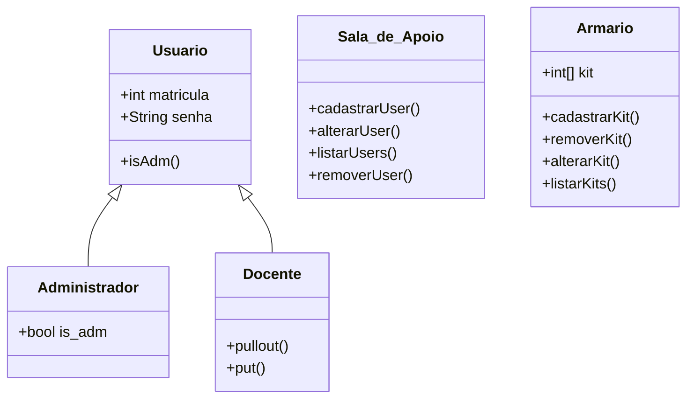

# Documento de Modelos

Neste documento temos o modelo Conceitual (UML) ou de Dados (Entidade-Relacionamento). Temos também a descrição das entidades e o dicionário de dados.

Para a modelagem pode se usar o Astah UML ou o BrModelo. Uma ferramenta interessante para modelos UML é a [YUML](http://yuml.me), no link temos um exemplo de [Modelo UML com YUML](yuml/monitoria-yuml.md). Atualmente é possível usar a ferramenta **Mermaid** segundo o blog do GitHub [Include diagrams in your Markdown files with Mermaid](https://github.blog/2022-02-14-include-diagrams-markdown-files-mermaid/). A documentação do **Mermaid** pode ser encontrada em [Mermaid in GitHub](https://mermaid-js.github.io/mermaid).

## Modelo Conceitual

### Diagrama de Classes usando Mermaid



### Descrição das Entidades

Descrição sucinta das entidades presentes no sistema.

| Entidade | Descrição   |
|----------|------------------------------------------------------------------------------------------------------------------------------------------------------|
| Usuario   | Entidade abstrata para representar informações gerais dos usuarios: matricula, senha, isAdm().        |
| Administrador     | Entidade que representa um administrador que tem a informação de +bool is_adm. A classe Administrador estende a classe abtrata Usuario. |
| Docente     | Entidade que representa um Docente tem as informações: +pullout(), +put(). A classe Docente estende a classe abstrata Usuario.  |
|Armario| Entidade que representa um Armario tem as informações de +int kit,+cadastrarKit(), +removerKit(), alterarKit(), listarKits.|
|Sala_de_Apoio| Entidade que representa a Sala de Apoio, tem as funções de +cadastrarUser(), +alterarUser(), +listarUser(), +removerUser().|

## Modelo de Dados (Entidade-Relacionamento)

Para criar modelos ER é possível usar o BrModelo e gerar uma imagem. Contudo, atualmente é possível criar modelos ER usando a ferramenta **Mermaid**, escrevendo o modelo diretamente em markdown. Acesse a documentação para escrever modelos [ER Diagram Mermaid](https://mermaid-js.github.io/mermaid/#/entityRelationshipDiagram).

```mermaid
erDiagram
    Usuario ||--| Administrador : adm
    Usuario ||--o{ Docente : docentes
    Administrador ||--|| Armario : armario
    Docente }|--|| Armario : kits
    Sala_de_Apoio ||--|| Armario : ""
    Sala_de_Apoio ||--|{ Usuario : ""
```

### Dicionário de Dados

|   Tabela   | Sala_de_Apoio  |
| ---------- | -------------- |
| Descrição  | Mantém os usuários podendo adicionar, alterar, remover e listar  |
| Observação | Apenas o Administrador vai poder adicionar os usuarios no sistema |

|  Nome         | Descrição                        | Tipo de Dado | Tamanho | Restrições de Domínio |
| ------------- | -------------------------------- | ------------ | ------- | --------------------- |
| codigo        | identificador gerado pelo SGBD   | SERIAL       | ---     | PK / Identity |
| matricula do usuario         | matricula para idenficar o usuario     | VARCHAR      | 15      | Unique / Not Null |
| senha do usuario          | senha do usuario              | VARCHAR      | 16     | Not Null |
|   kit   | codigo referente a cada kit    | VARCHAR      | 250     | --- |
